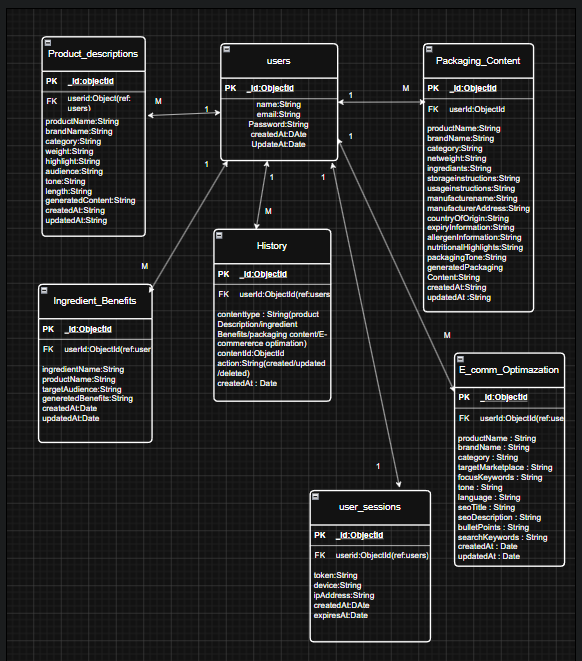

# Pack2Product

Pack2Product is an AI-assisted web application designed for food processing businesses to create professional, SEO-friendly product content for e-commerce platforms. It simplifies content creation by generating product descriptions and managing generated content through a secure dashboard.

---

# Features

### Authentication
- User Registration
- User Login
- Google OAuth Login
- JWT Authentication
- Protected API Routes
- Protected Frontend Routes
- Password Hashing using bcrypt
- Input Validation
- Rate Limiting
- Secure CORS Configuration

### Dashboard
- Responsive Dashboard
- Recent Content Section
- Quick Actions
- User Profile

### Product Description Generator
- Generate Product Descriptions
- Copy Generated Content
- Save Generated Description
- Edit Saved Description
- Delete Saved Description
- View Description Details

### History Management
- View Saved Descriptions
- Search Descriptions
- Update Existing Descriptions
- Delete Descriptions
- History Modal View

### User Experience
- Responsive Design
- Loading Spinner
- Toast Notifications
- Error Handling

---

# Tech Stack

## Frontend

- React.js
- React Router DOM
- Tailwind CSS
- Axios
- Lucide React

## Backend

- Node.js
- Express.js
- MongoDB Atlas
- Mongoose
- JWT
- Passport.js
- Google OAuth 2.0
- bcryptjs
- express-validator
- express-rate-limit

---

# Folder Structure

```text
Pack2Product
│
├── frontend
│   ├── src
│   ├── public
│   └── package.json
│
├── backend
│   ├── controllers
│   ├── middleware
│   ├── models
│   ├── routes
│   ├── server.js
│   └── package.json
│
├── README.md
└── .env.example
```

---

# Database


**Database Used:** MongoDB Atlas

**ODM:** Mongoose
## Set Up the Database

### 1. Create a MongoDB Atlas Cluster

- Create a free MongoDB Atlas account.
- Create an M0 Cluster.
- Create a Database User.
- Whitelist your IP Address.
- Copy the MongoDB Connection String.

### 2. Configure Environment Variables

Create a `.env` file inside the backend folder.

```env
PORT=5000
MONGODB_URI=your_mongodb_connection_string
JWT_SECRET=your_secret_key
```

### 3. Install Dependencies

```bash
npm install
```

### 4. Start the Backend

```bash
npm run dev
```

### 5. Start the Frontend

```bash
cd frontend
npm run dev
```

### Collections

- Users
- Product Descriptions

The application stores all generated descriptions in MongoDB, allowing users to create, view, update, and delete content even after refreshing the application.

---

# Database Schema

> Insert your Week 5 Schema Diagram image here.

Example:

```markdown

```

---

# Installation

## Clone Repository

```bash
git clone <repository-url>
```

---

## Backend Setup

```bash
cd backend
npm install
```

Create a `.env` file using `.env.example`

Run server

```bash
npm start
```

or

```bash
npm run dev
```

---

## Frontend Setup

```bash
cd frontend
npm install
npm run dev
```

---

# Environment Variables

```env
PORT=5000
MONGODB_URI=your_mongodb_connection_string
JWT_SECRET=your_jwt_secret
```

---

# API Endpoints

## Authentication

| Method | Endpoint |
|----------|----------|
| POST | /auth/register |
| POST | /auth/login |
| GET | /auth/google |
| GET | /auth/google/callback |
| GET | /auth/me |

## Product Description

| Method | Endpoint |
|---------|----------|
| POST | /content/generate |
| POST | /content/save |
| GET | /content |
| GET | /content/:id |
| PUT | /content/:id |
| DELETE | /content/:id |

---


# Authentication Flow

- User Registration
- User Login
- Google OAuth Login
- JWT Token Generation
- Protected Backend APIs
- Protected Frontend Routes
- Logout

---

# CRUD Operations

- ✅ Create Product Description
- ✅ Read Saved Descriptions
- ✅ Update Existing Description
- ✅ Delete Description

---

# Project Modules

- Home
- Login
- Register
- Dashboard
- Product Description
- History
- Recent Content

---

# Upcoming Modules

- Ingredient Benefits
- Packaging Content
- E-commerce Optimization

---

# Security Features

- JWT Authentication
- Google OAuth 2.0
- Password Hashing (bcrypt)
- Input Validation
- Rate Limiting
- Protected Routes
- Secure CORS Configuration

---

# Future Enhancements

- Google Gemini AI Integration
- Ingredient Benefits Generator
- Packaging Content Generator
- E-commerce Optimization Generator
- Multi-language Support
- Export to PDF
- User Profile
- Analytics Dashboard

---

# Author

**Sudhanshu Kumar**

MCA Student | Full Stack Web Developer