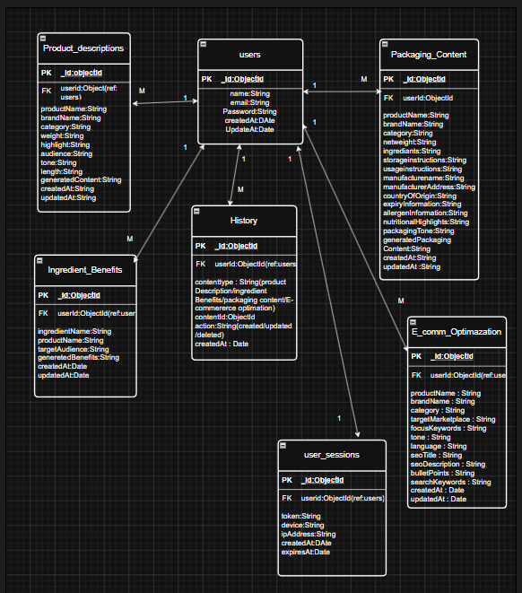

# Pack2Product

Pack2Product is an AI-powered web application designed for food processing businesses to generate professional product content for e-commerce platforms. The application uses Google Gemini AI to create SEO-friendly product descriptions, ingredient benefit summaries, and packaging labels. It also provides secure authentication, content management, history tracking, and user profile management through an intuitive dashboard.

---

# Features

## Authentication

- User Registration
- User Login
- Google OAuth Login
- JWT Authentication
- Protected Routes
- Password Hashing using bcrypt
- Input Validation
- Rate Limiting
- Secure CORS Configuration

## AI Features

- AI Product Description Generator
- Ingredient Benefits Generator
- Packaging Labels Generator
- Google Gemini 3.5 Flash Integration
- Copy Generated Content
- Save AI Content
- Regenerate Content

## Dashboard

- Responsive Dashboard
- Recent Content
- Quick Actions
- User Profile
- AI Tools Navigation

## History Management

- View Saved AI Content
- Search History
- Edit Saved Content
- Delete Content
- View Content Details

## Profile

- View Profile
- Edit Profile
- Activity Statistics
- Content Summary

### User Experience

- Responsive Design
- Toast Notifications
- Loading Indicators
- Error Handling
---

# Tech Stack

## Frontend

- React.js
- React Router DOM
- Tailwind CSS
- Axios
- Lucide React

## Backend

- Node.js
- Express.js
- MongoDB Atlas
- Mongoose
- JWT
- Passport.js
- Google OAuth 2.0
- bcryptjs
- express-validator
- express-rate-limit
- Google Gemini API

---


## AI Feature

The application uses Google Gemini 3.5 Flash to generate AI-powered content.

### Product Description Generator

Generates SEO-friendly product descriptions using:

- Product Name
- Brand Name
- Category
- Ingredients
- Net Weight
- Product Highlights
- Target Audience
- Tone
- Description Length
- Language

### Ingredient Benefits Generator

Generates concise ingredient benefit summaries using:

- Product Name
- Category
- Ingredients
- Target Audience
- Tone

### Packaging Labels Generator

Generates professional front and back packaging labels using:

- Product Information
- Packaging Details
- Manufacturing Information
- Food Type
- Storage Instructions
- Optional Information

---

# Folder Structure

```text
Pack2Product
│
├── frontend
│   ├── src
│   ├── public
│   └── package.json
│
├── backend
│   ├── controllers
│   ├── middleware
│   ├── models
│   ├── routes
│   ├── server.js
│   └── package.json
│
├── README.md
└── .env.example
```

---

# Database


**Database Used:** MongoDB Atlas

**ODM:** Mongoose
## Set Up the Database

### 1. Create a MongoDB Atlas Cluster

- Create a free MongoDB Atlas account.
- Create an M0 Cluster.
- Create a Database User.
- Whitelist your IP Address.
- Copy the MongoDB Connection String.

### 2. Configure Environment Variables

Create a `.env` file inside the backend folder.

```env
PORT=5000
MONGODB_URI=your_mongodb_connection_string
JWT_SECRET=your_secret_key
GEMINI_API_KEY=your_gemini_api_key
```

### 3. Install Dependencies

```bash
npm install
```

### 4. Start the Backend

```bash
npm run dev
```

### 5. Start the Frontend

```bash
cd frontend
npm run dev
```

### Collections

- Users
- Product Descriptions

The application stores all generated descriptions in MongoDB, allowing users to create, view, update, and delete content even after refreshing the application.

---

# Database Schema

> Insert your Week 5 Schema Diagram image here.

Example:

```markdown

```

---

# Installation

## Clone Repository

```bash
git clone <repository-url>
```

---

## Backend Setup

```bash
cd backend
npm install
```

Create a `.env` file using `.env.example`

Run server

```bash
npm start
```

or

```bash
npm run dev
```

---

## Frontend Setup

```bash
cd frontend
npm install
npm run dev
```

---

# Environment Variables

```env
PORT=5000
MONGODB_URI=your_mongodb_connection_string
JWT_SECRET=your_jwt_secret
```

---

# API Endpoints

## Authentication

| Method | Endpoint |
|----------|----------|
| POST | /auth/register |
| POST | /auth/login |
| GET | /auth/google |
| GET | /auth/google/callback |
| GET | /auth/me |

## Product Description

| Method | Endpoint |
|---------|----------|
| POST | /content/generate |
| POST | /content/save |
| GET | /content |
| GET | /content/:id |
| PUT | /content/:id |
| DELETE | /content/:id |

---
### AI

## AI

| Method | Endpoint |
|---------|----------|
| POST | /api/ai/description |
| POST | /api/ai/ingredient-benefits |
| POST | /api/ai/product-label |

## AI Workflow

1. User enters product details.
2. Frontend sends data to the backend.
3. Backend creates an optimized prompt.
4. Google Gemini generates the product description.
5. The generated description is returned to the frontend.
6. User can view and save the generated content.


# Authentication Flow

- User Registration
- User Login
- Google OAuth Login
- JWT Token Generation
- Protected Backend APIs
- Protected Frontend Routes
- Logout

---

# CRUD Operations

- ✅ Create Product content
- ✅ Read Saved content
- ✅ Update Existing content
- ✅ Delete content

---

# Project Modules

- Home
- Login
- Register
- Dashboard
- Product Description
- Ingredient Benefits
- Packaging Labels
- History
- Profile
- Recent Content

---

# Upcoming Modules

- E-commerce Optimization

---

# Security Features

- JWT Authentication
- Google OAuth 2.0
- Password Hashing (bcrypt)
- Input Validation
- Rate Limiting
- Protected Routes
- Secure CORS Configuration

---

# Future Enhancements

- Marketplace Listings Generator
- Multi-language Support
- Export AI Content to PDF
- Avatar Upload
- Analytics Dashboard
- AI Content Templates
- Bulk Content Generation

---
# Project Screenshots

## Home Page


## Dashboard


## Product Description Generator


## History Page


## profile Page


## Register Page


## Login Page


----

### Frontend
https://pack2-product.vercel.app

### Backend
https://pack2product.onrender.com

### Github
 https://github.com/yourusername/Pack2Product 
### Database
- MongoDB Atlas
- Mongoose

### Deployment
- Vercel (Frontend)
- Render (Backend)

---

# Author

**Sudhanshu Kumar**

MCA Student | Full Stack Web Developer